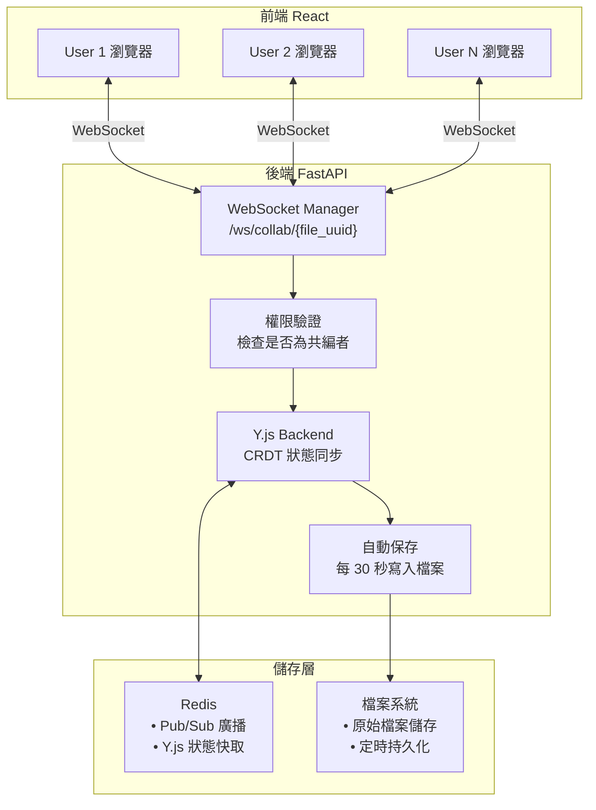
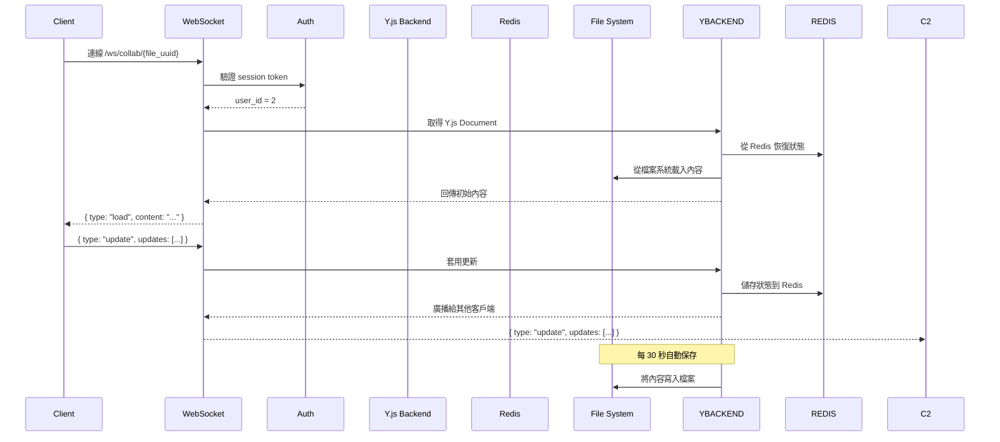
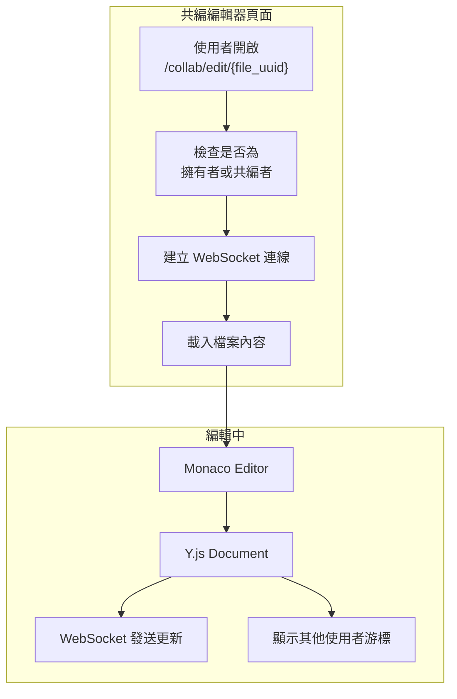

# 即時共編功能 — 完整架構規劃

## 1. 功能概述

讓多位使用者可以**同時在線編輯同一個文字檔案**，類似 Google Docs 的協作體驗。

### 核心功能
| 功能 | 說明 |
|------|------|
| 即時同步 | 多人編輯時，所有參與者即時看到彼此的修改 |
| 衝突處理 | 使用 CRDT 演算法自動處理多人同時編輯的衝突 |
| 權限控制 | 只有被邀請的共編者可以編輯 |
| 自動保存 | 定期將編輯內容保存到檔案系統 |

---

## 2. 整體架構



---

## 3. 技術選型

### 3.1 CRDT 演算法 — Y.js

選擇 **Y.js** 作為協作核心，原因：

| 特性 | Y.js | OT |
|------|------|-----|
| 網路延遲容忍 | ✅ 高 | ❌ 需低延遲 |
| 離線編輯支援 | ✅ 支援 | ❌ 不支援 |
| 成熟度 | ✅ 廣泛使用 | ✅ 但較複雜 |
| Python 支援 | ✅ `y-py` | ❌ 無官方支援 |

### 3.2 編輯器 — Monaco Editor

選擇 **Monaco Editor**（VS Code 核心）原因：
- 語法高亮度
- 程式碼折疊
- 多游標編輯
- React 整合套件 `@monaco-editor/react`

### 3.3 通訊 — WebSocket

FastAPI 原生支援 WebSocket，不需要額外套件。

---

## 4. 後端架構

### 4.1 新增檔案

| 檔案 | 說明 |
|------|------|
| [`app/services/collab_service.py`](backend/app/services/collab_service.py) | WebSocket 連線管理、CRDT 同步邏輯 |
| [`app/api/v1/collab_ws.py`](backend/app/api/v1/collab_ws.py) | WebSocket 端點 |
| [`app/schemas/collab.py`](backend/app/schemas/collab.py) | WebSocket 訊息格式定義 |

### 4.2 WebSocket 端點

```
ws://localhost:8000/ws/collab/{file_uuid}?token={session_token}
```

### 4.3 WebSocket 訊息格式

```json
// Client → Server: 編輯操作
{
    "type": "update",
    "data": {
        "updates": [1, 2, 3, ...],  // Y.js binary update
        "awareness": {               // 游標位置
            "cursor": { "line": 10, "col": 5 },
            "user": { "id": 2, "name": "ccf5171" }
        }
    }
}

// Server → Client: 廣播更新
{
    "type": "sync",
    "data": {
        "updates": [4, 5, 6, ...],  // Y.js binary update
        "users": [                   // 線上使用者列表
            { "id": 2, "name": "ccf5171", "cursor": {...} },
            { "id": 3, "name": "testuser1", "cursor": {...} }
        ]
    }
}

// Server → Client: 初始載入
{
    "type": "load",
    "content": "檔案完整內容...",
    "users": [...]
}
```

### 4.4 後端流程



---

## 5. 前端架構

### 5.1 新增檔案

| 檔案 | 說明 |
|------|------|
| [`pages/Collaboration/CollabEditor.tsx`](frontend/src/pages/Collaboration/CollabEditor.tsx) | 共編編輯器頁面 |
| [`hooks/useCollab.ts`](frontend/src/hooks/useCollab.ts) | WebSocket + Y.js 同步邏輯 |
| [`api/collabApi.ts`](frontend/src/api/collabApi.ts) | WebSocket 連線管理 |

### 5.2 前端流程



### 5.3 路由

在 [`router/index.tsx`](frontend/src/router/index.tsx) 新增：

```tsx
{
    path: '/collab/edit/:fileUuid',
    element: <CollabEditor />
}
```

---

## 6. 需要安裝的套件

### 後端

```bash
cd backend
uv add y-py
```

### 前端

```bash
cd frontend
pnpm add @monaco-editor/react yjs y-websocket
```

---

## 7. 需要修改的檔案清單

### 後端（Backend）

| 檔案 | 操作 | 說明 |
|------|------|------|
| [`app/services/collab_service.py`](backend/app/services/collab_service.py) | **新增** | WebSocket 連線管理、Y.js 同步 |
| [`app/api/v1/collab_ws.py`](backend/app/api/v1/collab_ws.py) | **新增** | WebSocket 端點 |
| [`app/schemas/collab.py`](backend/app/schemas/collab.py) | **新增** | WebSocket 訊息格式 |
| [`app/main.py`](backend/app/main.py) | **修改** | 註冊 WebSocket 路由 |
| [`pyproject.toml`](backend/pyproject.toml) | **修改** | 加入 `y-py` 依賴 |

### 前端（新增）

| 檔案 | 操作 | 說明 |
|------|------|------|
| [`pages/Collaboration/CollabEditor.tsx`](frontend/src/pages/Collaboration/CollabEditor.tsx) | **新增** | 共編編輯器頁面 |
| [`hooks/useCollab.ts`](frontend/src/hooks/useCollab.ts) | **新增** | WebSocket + Y.js 同步邏輯 |
| [`api/collabApi.ts`](frontend/src/api/collabApi.ts) | **新增** | WebSocket 連線管理 |
| [`router/index.tsx`](frontend/src/router/index.tsx) | **修改** | 新增 `/collab/edit/:fileUuid` 路由 |
| [`package.json`](frontend/package.json) | **修改** | 加入 `@monaco-editor/react`、`yjs`、`y-websocket` 依賴 |

---

## 8. 實作步驟


### Step 1: 安裝套件
- 後端：`uv add y-py`
- 前端：`pnpm add @monaco-editor/react yjs y-websocket`

### Step 2: 後端 WebSocket
- 建立 `collab_service.py` — WebSocket 連線管理
- 建立 `collab_ws.py` — WebSocket 端點
- 建立 `collab.py` — 訊息格式
- 修改 `main.py` — 註冊路由

### Step 3: 前端編輯器
- 建立 `useCollab.ts` — WebSocket + Y.js 同步
- 建立 `CollabEditor.tsx` — Monaco Editor 編輯器
- 建立 `collabApi.ts` — WebSocket 連線
- 修改 `router/index.tsx` — 新增路由

### Step 4: 整合測試
- 測試 WebSocket 連線
- 測試多人同時編輯
- 測試權限控制
- 測試自動保存

---

## 9. 注意事項

1. **權限控制**：只有檔案的擁有者或被邀請的共編者可以編輯
2. **自動保存**：每 30 秒將 Y.js 的內容寫入檔案系統
3. **連線中斷**：使用者斷線後重新連線時，從 Redis 恢復狀態
4. **游標顯示**：使用 Y.js Awareness 協定顯示其他使用者的游標位置
5. **檔案類型**：目前只支援文字檔案（.txt、.md、.py、.js 等）