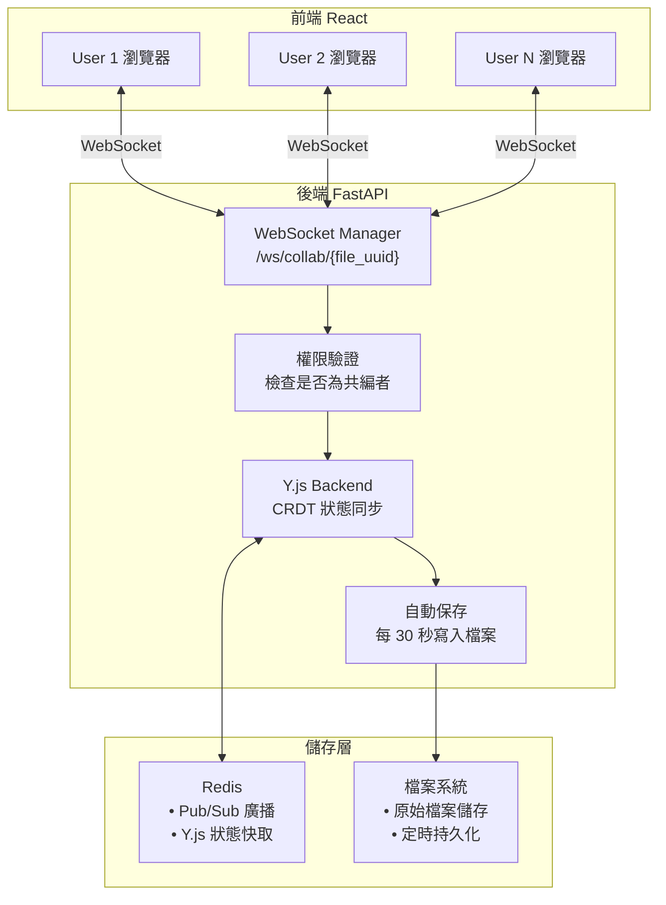
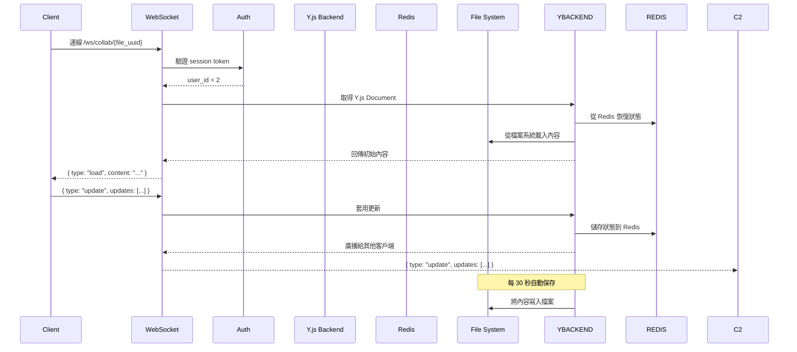
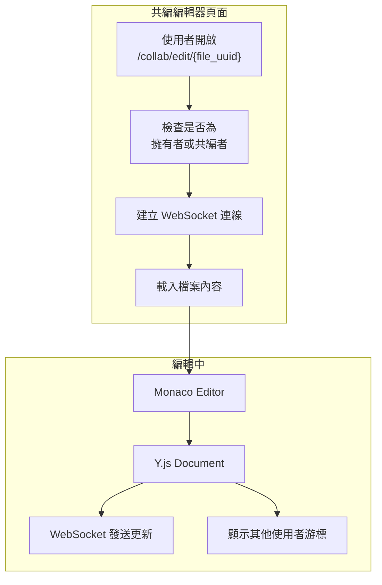
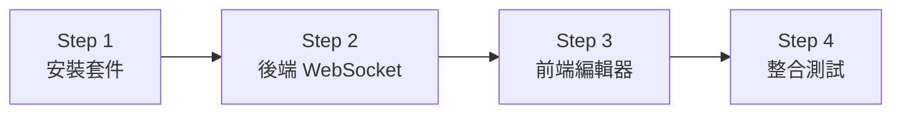

# 即時共編功能 — 完整架構規劃

## 1. 功能概述

讓多位使用者可以**同時在線編輯同一個文字檔案**，類似 Google Docs 的協作體驗。

### 核心功能
| 功能 | 說明 |
|------|------|
| 即時同步 | 多人編輯時，所有參與者即時看到彼此的修改 |
| 衝突處理 | 使用 CRDT 演算法自動處理多人同時編輯的衝突 |
| 權限控制 | 只有被邀請的共編者可以編輯 |
| 自動保存 | 定期將編輯內容保存到檔案系統 |

---

## 2. 整體架構



---

## 3. 技術選型

### 3.1 CRDT 演算法 — Y.js

選擇 **Y.js** 作為協作核心，原因：

| 特性 | Y.js | OT |
|------|------|-----|
| 網路延遲容忍 | ✅ 高 | ❌ 需低延遲 |
| 離線編輯支援 | ✅ 支援 | ❌ 不支援 |
| 成熟度 | ✅ 廣泛使用 | ✅ 但較複雜 |
| Python 支援 | ✅ `y-py` | ❌ 無官方支援 |

### 3.2 編輯器 — Monaco Editor

選擇 **Monaco Editor**（VS Code 核心）原因：
- 語法高亮度
- 程式碼折疊
- 多游標編輯
- React 整合套件 `@monaco-editor/react`

### 3.3 通訊 — WebSocket

FastAPI 原生支援 WebSocket，不需要額外套件。

---

## 4. 後端架構

### 4.1 新增檔案

| 檔案 | 說明 |
|------|------|
| [`app/services/collab_service.py`](backend/app/services/collab_service.py) | WebSocket 連線管理、CRDT 同步邏輯 |
| [`app/api/v1/collab_ws.py`](backend/app/api/v1/collab_ws.py) | WebSocket 端點 |
| [`app/schemas/collab.py`](backend/app/schemas/collab.py) | WebSocket 訊息格式定義 |

### 4.2 WebSocket 端點

```
ws://localhost:8000/ws/collab/{file_uuid}?token={session_token}
```

### 4.3 WebSocket 訊息格式

```json
// Client → Server: 編輯操作
{
    "type": "update",
    "data": {
        "updates": [1, 2, 3, ...],  // Y.js binary update
        "awareness": {               // 游標位置
            "cursor": { "line": 10, "col": 5 },
            "user": { "id": 2, "name": "ccf5171" }
        }
    }
}

// Server → Client: 廣播更新
{
    "type": "sync",
    "data": {
        "updates": [4, 5, 6, ...],  // Y.js binary update
        "users": [                   // 線上使用者列表
            { "id": 2, "name": "ccf5171", "cursor": {...} },
            { "id": 3, "name": "testuser1", "cursor": {...} }
        ]
    }
}

// Server → Client: 初始載入
{
    "type": "load",
    "content": "檔案完整內容...",
    "users": [...]
}
```

### 4.4 後端流程



---

## 5. 前端架構

### 5.1 新增檔案

| 檔案 | 說明 |
|------|------|
| [`pages/Collaboration/CollabEditor.tsx`](frontend/src/pages/Collaboration/CollabEditor.tsx) | 共編編輯器頁面 |
| [`hooks/useCollab.ts`](frontend/src/hooks/useCollab.ts) | WebSocket + Y.js 同步邏輯 |
| [`api/collabApi.ts`](frontend/src/api/collabApi.ts) | WebSocket 連線管理 |

### 5.2 前端流程



### 5.3 路由

在 [`router/index.tsx`](frontend/src/router/index.tsx) 新增：

```tsx
{
    path: '/collab/edit/:fileUuid',
    element: <CollabEditor />
}
```

---

## 6. 需要安裝的套件

### 後端

```bash
cd backend
uv add y-py
```

### 前端

```bash
cd frontend
pnpm add @monaco-editor/react yjs y-websocket
```

---

## 7. 需要修改的檔案清單

### 後端（Backend）

| 檔案 | 操作 | 說明 |
|------|------|------|
| [`app/services/collab_service.py`](backend/app/services/collab_service.py) | **新增** | WebSocket 連線管理、Y.js 同步 |
| [`app/api/v1/collab_ws.py`](backend/app/api/v1/collab_ws.py) | **新增** | WebSocket 端點 |
| [`app/schemas/collab.py`](backend/app/schemas/collab.py) | **新增** | WebSocket 訊息格式 |
| [`app/main.py`](backend/app/main.py) | **修改** | 註冊 WebSocket 路由 |
| [`pyproject.toml`](backend/pyproject.toml) | **修改** | 加入 `y-py` 依賴 |

### 前端（新增）

| 檔案 | 操作 | 說明 |
|------|------|------|
| [`pages/Collaboration/CollabEditor.tsx`](frontend/src/pages/Collaboration/CollabEditor.tsx) | **新增** | 共編編輯器頁面 |
| [`hooks/useCollab.ts`](frontend/src/hooks/useCollab.ts) | **新增** | WebSocket + Y.js 同步邏輯 |
| [`api/collabApi.ts`](frontend/src/api/collabApi.ts) | **新增** | WebSocket 連線管理 |
| [`router/index.tsx`](frontend/src/router/index.tsx) | **修改** | 新增 `/collab/edit/:fileUuid` 路由 |
| [`package.json`](frontend/package.json) | **修改** | 加入 `@monaco-editor/react`、`yjs`、`y-websocket` 依賴 |

---

## 8. 實作步驟



### Step 1: 安裝套件
- 後端：`uv add y-py`
- 前端：`pnpm add @monaco-editor/react yjs y-websocket`

### Step 2: 後端 WebSocket
- 建立 `collab_service.py` — WebSocket 連線管理
- 建立 `collab_ws.py` — WebSocket 端點
- 建立 `collab.py` — 訊息格式
- 修改 `main.py` — 註冊路由

### Step 3: 前端編輯器
- 建立 `useCollab.ts` — WebSocket + Y.js 同步
- 建立 `CollabEditor.tsx` — Monaco Editor 編輯器
- 建立 `collabApi.ts` — WebSocket 連線
- 修改 `router/index.tsx` — 新增路由

### Step 4: 整合測試
- 測試 WebSocket 連線
- 測試多人同時編輯
- 測試權限控制
- 測試自動保存

---

## 9. 注意事項

1. **權限控制**：只有檔案的擁有者或被邀請的共編者可以編輯
2. **自動保存**：每 30 秒將 Y.js 的內容寫入檔案系統
3. **連線中斷**：使用者斷線後重新連線時，從 Redis 恢復狀態
4. **游標顯示**：使用 Y.js Awareness 協定顯示其他使用者的游標位置
5. **檔案類型**：目前只支援文字檔案（.txt、.md、.py、.js 等）

---

## 10. 2026-06-18 實作紀錄

### 10.1 本次目標

原本共編採用「整份文字內容同步」：

```text
Client A 編輯 -> 傳整份 content -> Backend 廣播整份 content -> Client B 覆蓋 editor
```

這種方式在兩人以上同時編輯時會有幾個問題：

- 遠端更新會干擾本地游標與選取範圍
- 編輯區會閃爍
- 兩人同時修改同一段文字時，後送出的整份內容容易覆蓋另一人的修改

本次目標是把共編核心改成 Yjs CRDT 更新同步，讓多人編輯時由 Yjs 合併操作，而不是用整份文字互相覆蓋。

### 10.2 實際採用架構

目前未新增後端 `y-py`，而是採用「前端 Yjs 合併 + 後端 WebSocket relay」：

```text
Monaco Editor
  -> y-monaco / Y.Text
  -> Yjs binary update
  -> FastAPI WebSocket relay
  -> Redis 保存 update log
  -> 其他 Client 套用 Yjs update
```

後端同時保存純文字內容到 `collab_content:{file_uuid}`，供以下功能使用：

- 手動儲存
- 30 秒自動儲存
- Redis 快照
- 版本切換

### 10.3 已修改檔案

| 檔案 | 說明 |
|------|------|
| [`frontend/src/hooks/useYCollab.ts`](../frontend/src/hooks/useYCollab.ts) | 新增 Yjs WebSocket hook，處理 `y_update`、`y_reset`、快照列表、儲存與版本切換 |
| [`frontend/src/pages/Collaboration/CollabEditor.tsx`](../frontend/src/pages/Collaboration/CollabEditor.tsx) | 改用 `Y.Doc`、`Y.Text`、`MonacoBinding`，移除整份文字 `value/onChange` 同步 |
| [`backend/app/api/v1/collab_ws.py`](../backend/app/api/v1/collab_ws.py) | 新增 Yjs update relay、Redis update log、Yjs base content、版本切換 reset |
| [`backend/app/config.py`](../backend/app/config.py) | 新增 `SNAPSHOT_INTERVAL` 設定，允許 `.env` 控制快照間隔 |
| [`backend/app/main.py`](../backend/app/main.py) | 快照排程改成依 `settings.SNAPSHOT_INTERVAL` 判斷 |
| [`backend/app/services/snapshot_service.py`](../backend/app/services/snapshot_service.py) | 快照改成讀 env 設定、去重、最多保留 3 筆、最新版本排第一 |
| [`backend/.env.example`](../backend/.env.example) | 補上 `SNAPSHOT_INTERVAL` 範例設定 |

### 10.4 WebSocket 訊息

#### Client -> Server: Yjs 更新

```json
{
  "type": "y_update",
  "update": "base64 encoded Yjs update",
  "content": "目前純文字內容"
}
```

#### Server -> Client: Yjs 更新廣播

```json
{
  "type": "y_update",
  "user_id": 2,
  "update": "base64 encoded Yjs update"
}
```

#### Server -> Client: 初始載入

```json
{
  "type": "load_file",
  "content": "Yjs 文件基底文字",
  "y_updates": ["base64 update 1", "base64 update 2"],
  "needs_y_init": false,
  "users": [1, 2],
  "snapshots": [
    { "id": 123, "timestamp": "2026-06-18 10:00:00" }
  ]
}
```

`needs_y_init` 用來避免多個 client 同時各自建立不同的 Yjs 初始文件。只有第一個進入房間且 Redis 尚無 `collab_yupdates:{file_uuid}` 的 client 會收到 `needs_y_init: true`，並回傳第一份 `y_init_state`。

#### Client -> Server: 初始化 Yjs state

```json
{
  "type": "y_init_state",
  "update": "base64 encoded Yjs full state",
  "content": "目前純文字內容"
}
```

#### Server -> Client: 版本切換後重置 Yjs 狀態

```json
{
  "type": "y_reset",
  "content": "指定版本內容",
  "version_id": 123,
  "snapshots": []
}
```

### 10.5 Redis Key

| Key | 說明 |
|-----|------|
| `collab_content:{file_uuid}` | 目前純文字內容，供儲存與快照使用 |
| `collab_ybase:{file_uuid}` | Yjs 文件基底文字 |
| `collab_yupdates:{file_uuid}` | Yjs update log，最多保留 1000 筆 |
| `collab_yversion:{file_uuid}` | Yjs state 格式版本，用來自動清掉舊版不相容 update log |
| `collab_snapshot:{file_uuid}` | 版本快照 JSON，最多保留 3 筆 |

初始化流程：

1. 後端載入 `collab_yupdates:{file_uuid}`。
2. 如果 update log 已存在，client 直接套用這些 Yjs updates。
3. 如果 update log 不存在且目前 client 是房間第一人，後端送 `needs_y_init: true`。
4. 第一個 client 根據檔案純文字建立 Yjs document，回傳 `y_init_state`。
5. 其他同房 client 等待並套用同一份 `y_init_state`，避免不同 client 各自建立互不相容的 CRDT 初始基底。

### 10.6 與原規劃差異

原規劃提到後端可使用 `y-py` 管理 Yjs document。這次尚未引入 `y-py`，原因是目前前端依賴已經有 `yjs`、`y-monaco`，可先用後端 relay 方式完成多人合併核心，避免新增後端依賴與資料轉換複雜度。

目前後端不解析 Yjs 文件，只保存和轉發更新。純文字內容由前端隨 `y_update` 或 `save` 傳回後端，用於檔案儲存與快照。

### 10.7 已驗證項目

```text
pnpm exec tsc --noEmit
uv run python -m py_compile app/api/v1/collab_ws.py
uv run python -c "from app.main import app; print('backend ok')"
```

檢查結果：前端 TypeScript 通過，後端匯入與語法檢查通過。

### 10.8 待測與後續改善

1. 兩個不同帳號同時開啟同一份共編檔案，確認文字不再互相覆蓋。
2. 測試同一段文字同時插入與刪除，確認 Yjs 合併行為穩定。
3. 測試重整頁面後，後端能從 `collab_ybase` + `collab_yupdates` 恢復文件狀態。
4. 測試版本切換後，所有在線使用者都會收到 `y_reset` 並切到指定版本內容。
5. 若未來需要更完整的後端持久化，可再導入 `y-py` 或改用標準 `y-websocket` provider。
6. 目前尚未接入 Yjs Awareness，因此還沒有顯示其他使用者的即時游標顏色與選取範圍。

### 10.9 版本切換修正紀錄

快照 id 目前由後端用 `time.time_ns()` 產生，數值會超過 JavaScript 的安全整數範圍。前端若使用 `Number(e.target.value)` 會造成 id 精度失真，導致送回後端的 `version_id` 對不到 Redis 中的快照 id，表現為「點版本沒有反應」。

修正方式：

- 前端版本選單一律用 `String(s.id)` 當 option value
- `switchVersion` 改成傳遞字串 id，不再轉成 `Number`
- 後端 `switch_to_snapshot` 改成用 `str(s["id"]) == str(snapshot_id)` 比對
- 選單切換後重設回預設值，避免重複選同一版本時瀏覽器不觸發 `change`
- 切換版本時不再先呼叫 `save_snapshot(current)`，避免新增快照後因最多保留 3 筆而把使用者正要切換的舊版本擠掉
- 後端新增 `switch_version_failed` 訊息，找不到指定版本時不再靜默失敗

### 10.10 共編無法同步修正紀錄

修正兩個容易造成「看似連線成功但不能共同編輯」的問題：

1. 前端 `CollabEditor` 原本在 cleanup 中呼叫 `ydoc.destroy()`。React/Vite 開發模式可能反覆執行 effect cleanup，導致仍在使用的 Yjs document 被銷毀。已移除該 cleanup，只保留 `MonacoBinding.destroy()`。
2. Redis 可能保留前幾版壞掉的 `collab_yupdates:{file_uuid}`。後端新增 `collab_yversion:{file_uuid}`，版本不符時會用目前 `collab_content:{file_uuid}` 重新建立乾淨的 Yjs base state，避免舊 state 阻斷同步。

### 10.11 空內容覆寫事故修正紀錄

測試共編時曾出現檔案內容看似被清空的情況。檢查後確認磁碟檔案仍有內容，Redis 的 `collab_content:{file_uuid}` 也仍有內容，但 `collab_ybase:{file_uuid}` 停在舊內容，`collab_yupdates:{file_uuid}` 堆到 1000 筆，導致 Yjs 初始化用錯 base/update log，畫面表現像內容消失或不同步。

修正方式：

- `Y_STATE_VERSION` 升到 `3`，強制舊版不相容 Yjs state 重建
- `_ensure_y_state_version` 不再先刪 `collab_content:{file_uuid}`，避免丟失 Redis 中尚未落盤的非空內容
- `_load_file_content` 不再把空字串 Redis cache 當成有效來源，空 cache 會回退讀磁碟檔
- `_save_file_content` 若收到空字串，且磁碟上已有非空檔案，會拒絕覆寫
- `save` 訊息只有在 content 非空時才會更新 Redis 與磁碟
- 針對測試檔 `54367b4c-c213-4bbd-9f7d-3f4acd594579`，已將 `collab_ybase` 重建成目前 `collab_content`，清空錯誤的 `collab_yupdates`，並設定 `collab_yversion=3`
- 後端送給前端的 snapshot summary 會把 `id` 轉成字串，避免 JSON parse 後 JavaScript 將奈秒級 id 轉成不安全整數
- 針對測試檔已從 Redis 中最後保留的非空 `collab_ybase` 復原磁碟檔、`collab_content`、`collab_ybase` 與一份非空 snapshot

### 10.12 純 Yjs 重整紀錄

使用者確認共編核心要直接完整採用 Yjs，同時仍需保證版本、共編、自動儲存正確性。因此將共編同步與文字持久化分離：

#### 同步路徑

```text
Monaco Editor
  -> y-monaco / Y.Text
  -> y_update
  -> FastAPI WebSocket relay
  -> 其他 client apply Yjs update
```

#### 持久化路徑

```text
Y.Text.toString()
  -> persist_text
  -> collab_content:{file_uuid}
  -> 磁碟檔案
  -> snapshot scheduler
```

本次重整：

- 前端 `useYCollab` 將手動/自動儲存訊息改為 `persist_text`
- 後端 `collab_ws.py` 不再處理舊的 `update` 整份內容廣播
- `persist_text` 只作為文字投影，不參與共編同步
- 後端仍保留 `save` 作為相容 alias，但前端不再使用
- `Y_STATE_VERSION` 升到 `4`，讓舊版 Yjs state 自動重建
- 快照排序可同時處理字串與整數 id，避免混合型別排序錯誤

目前協定邊界：

| 訊息 | 方向 | 用途 |
|------|------|------|
| `load_file` | Server -> Client | 載入 Yjs base/update log、線上使用者、快照列表 |
| `y_init_state` | Client -> Server / Server -> Client | 第一個 client 初始化 Yjs full state |
| `y_update` | Client -> Server / Server -> Client | 唯一共編同步訊息 |
| `persist_text` | Client -> Server | 將目前 `Y.Text.toString()` 作為文字投影持久化 |
| `get_snapshots` | Client -> Server | 查詢版本快照 |
| `snapshots` | Server -> Client | 回傳版本快照列表 |
| `switch_version` | Client -> Server | 切換到指定快照 |
| `y_reset` | Server -> Client | 版本切換後重置所有 client 的 Yjs 可見內容 |

驗證：

```text
pnpm exec tsc --noEmit
uv run python -m py_compile app/api/v1/collab_ws.py app/services/snapshot_service.py
uv run python -c "from app.main import app; from app.config import settings; print('backend ok', settings.SNAPSHOT_INTERVAL)"
```

前端 TypeScript 通過，後端語法通過，設定讀取 `SNAPSHOT_INTERVAL=30`。`app.main` 匯入會啟動背景 scheduler，因此該檢查印出成功訊息後可能等到命令逾時。

### 10.13 版本切換與立即快照修正

版本切換後曾出現所有人無法繼續共編，原因是後端用 `y_reset` 清掉 Redis Yjs state，並要求多個 client 重新初始化 Yjs document。不同 client 的 Y.Doc 歷史可能因此不一致。

修正方式：

- 後端 `switch_version` 不再廣播 `y_reset`
- 後端找到 snapshot 後，只回覆觸發者 `apply_version`
- 觸發者收到 `apply_version` 後，用 Yjs 對 `Y.Text` 做一次正常 replace 操作
- 這次 replace 會產生一般 `y_update`
- 其他在線使用者透過普通 `y_update` 套用版本內容，因此切換版本後仍維持同一條 Yjs 共編歷史

儲存按鈕行為也調整：

- 自動儲存仍只送 `persist_text`
- 手動按下儲存會送 `persist_text` 並帶 `create_snapshot: true`
- 後端收到 `create_snapshot` 後會立即呼叫 `save_snapshot`
- 儲存按鈕不必再等 `SNAPSHOT_INTERVAL` 才刷新版本快照

### 10.14 同時輸入覆蓋修正

同時輸入時曾出現 A 的內容覆蓋 B 的內容。判斷原因有兩個：

1. 後端房間表原本以 `user_id` 當 key，同一帳號多分頁測試時，後連線會覆蓋前連線，造成其中一個 client 收不到 Yjs update。
2. `y_update` 原本同時帶 `content` 給後端更新 `collab_content:{file_uuid}`。這份 content 是該 client 送出 update 當下看到的全文；多人同時輸入時，可能尚未包含其他人的 update，導致 Redis 純文字投影被最後送出的半成品覆蓋。

修正方式：

- 後端 `rooms` 改成每條 WebSocket 連線一個 `connection_id`，同一使用者多分頁也能同時留在房間內。
- 廣播排除對象改用 `connection_id`，不再用 `user_id`。
- 線上使用者列表改由目前房間連線重新計算並送出 `users` 訊息。
- `y_update` 現在只負責傳送 Yjs binary update，不再更新 Redis 純文字內容。
- 前端新增 `y_projection`：任何本地或遠端 Yjs update 套用後，短暫 debounce，再把目前合併後的 `Y.Text.toString()` 送到後端更新 `collab_content:{file_uuid}`。
- `persist_text` 仍保留給自動儲存與手動儲存；手動儲存帶 `create_snapshot: true` 時會立即刷新版本快照。

目前同步邊界：

| 訊息 | 方向 | 用途 |
|------|------|------|
| `y_update` | Client -> Server / Server -> Client | 只傳 Yjs delta，負責共編合併 |
| `y_projection` | Client -> Server | 更新 Redis 純文字投影，供自動儲存與快照使用 |
| `persist_text` | Client -> Server | 自動/手動儲存目前全文；手動儲存可立即建立快照 |

### 10.15 第三人加入與版本疊加修正

第三人進入時曾看到空白內容，且第三人切換版本後，A/B 的內容會變成「舊內容接在新內容後面」。原因是第三人的 Yjs document 沒有完整還原：

- 後端只保存 `collab_yupdates:{file_uuid}` 增量列表。
- 若初始化 update 不完整，或 update log 被裁切，第三人只套用增量時無法重建目前文件。
- 第三人的 Yjs document 若是空的，再執行版本切換，產生的 replace delta 對 A/B 來說會像「插入舊內容」，因此出現疊加。

修正方式：

- 新增 Redis key：`collab_ystate:{file_uuid}`，保存完整 `Y.encodeStateAsUpdate(ydoc)`。
- 前端 `y_projection` 除了送純文字 `content`，也送完整 `state_update`。
- 後端 `load_file` 優先回傳 `y_state`，新加入的 client 優先套用完整 Yjs state。
- `y_init_state` 也會寫入 `collab_ystate:{file_uuid}`，讓第一份初始化文件可被後續 client 完整還原。
- `Y_STATE_VERSION` 升到 `5`，避免舊版不完整 update log 影響新連線。

新的載入優先順序：

```text
1. 如果 Redis 有 collab_ystate:{file_uuid} -> 套完整 Yjs state
2. 否則如果有 collab_yupdates:{file_uuid} -> 套 update log
3. 否則第一個 client 用 content 初始化 Yjs document
4. 其他 client 等待 y_init_state
```
