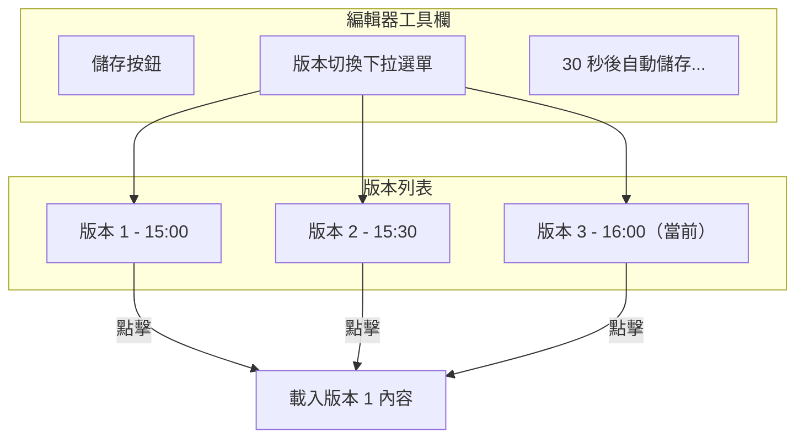

# 版本快照與自動儲存功能規劃

## 功能需求

1. **每 30 秒自動儲存** — 從 Redis 讀取最新內容寫入硬碟
2. **版本快照** — 每次編輯時在 Redis 中儲存快照，單一檔案最多 3 個版本，超過則覆蓋最舊的
3. **版本切換** — 使用者可以在前端自由切換 3 個版本

---

## 1. Redis 資料結構

```redis
# 最新內容（即時編輯）
collab_content:{file_uuid} -> "檔案內容..."

# 版本快照（最多 3 個）
collab_snapshots:{file_uuid} -> JSON array
[
  {"id": 1, "content": "...", "timestamp": "2026-06-17 15:00:00"},
  {"id": 2, "content": "...", "timestamp": "2026-06-17 15:00:30"},
  {"id": 3, "content": "...", "timestamp": "2026-06-17 15:01:00"}
]

# 當前版本索引
collab_current_version:{file_uuid} -> 2  # 預設為最新版本
```

---

## 3. 後端架構

### 新增檔案

| 檔案 | 說明 |
|------|------|
| [`app/services/snapshot_service.py`](backend/app/services/snapshot_service.py) | 快照管理、自動儲存排程 |

### 修改檔案

| 檔案 | 說明 |
|------|------|
| [`app/api/v1/collab_ws.py`](backend/app/api/v1/collab_ws.py) | 加入快照相關 WebSocket 訊息處理 |
| [`app/main.py`](backend/app/main.py) | 啟動自動儲存排程 |

### WebSocket 新增訊息類型

```json
// Server → Client: 版本列表
{
  "type": "snapshots",
  "snapshots": [
    {"id": 1, "timestamp": "2026-06-17 15:00:00"},
    {"id": 2, "timestamp": "2026-06-17 15:00:30"},
    {"id": 3, "timestamp": "2026-06-17 15:01:00"}
  ],
  "current_version": 3
}

// Client → Server: 切換版本
{
  "type": "switch_version",
  "version_id": 1
}

// Server → Client: 切換版本後載入內容
{
  "type": "load_version",
  "content": "...",
  "version_id": 1
}
```

---

## 4. 前端架構

### 修改檔案

| 檔案 | 說明 |
|------|------|
| [`pages/Collaboration/CollabEditor.tsx`](frontend/src/pages/Collaboration/CollabEditor.tsx) | 加入版本切換 UI |

### 版本切換 UI



---

## 5. 實作步驟

### Step 1: 建立 SnapshotService

```python
class SnapshotService:
    MAX_SNAPSHOTS = 3
    SNAPSHOT_INTERVAL = 30  # 秒

    def save_snapshot(self, file_uuid: str, redis: Redis):
        # 1. 從 Redis 讀取最新內容
        # 2. 儲存快照到 Redis list
        # 3. 如果超過 3 個，刪除最舊的
        # 4. 同時寫入硬碟

    def get_snapshots(self, file_uuid: str, redis: Redis) -> list:
        # 回傳快照列表

    def switch_version(self, file_uuid: str, version_id: int, redis: Redis):
        # 切換到指定版本
```

### Step 2: 修改 WebSocket 端點

- 在 `update` 訊息處理中加入快照儲存
- 加入 `switch_version` 訊息處理
- 連線時傳送快照列表

### Step 3: 修改前端

- 在工具欄中加入版本切換下拉選單
- 處理 `snapshots` 和 `load_version` 訊息
- 發送 `switch_version` 訊息

---

## 6. 需要修改的檔案清單

| 檔案 | 操作 | 說明 |
|------|------|------|
| [`app/services/snapshot_service.py`](backend/app/services/snapshot_service.py) | **新增** | 快照管理邏輯 |
| [`app/api/v1/collab_ws.py`](backend/app/api/v1/collab_ws.py) | **修改** | 加入快照相關 WebSocket 訊息 |
| [`app/main.py`](backend/app/main.py) | **修改** | 啟動自動儲存排程 |
| [`pages/Collaboration/CollabEditor.tsx`](frontend/src/pages/Collaboration/CollabEditor.tsx) | **修改** | 加入版本切換 UI |
| [`hooks/useCollab.ts`](frontend/src/hooks/useCollab.ts) | **修改** | 處理快照相關訊息 |